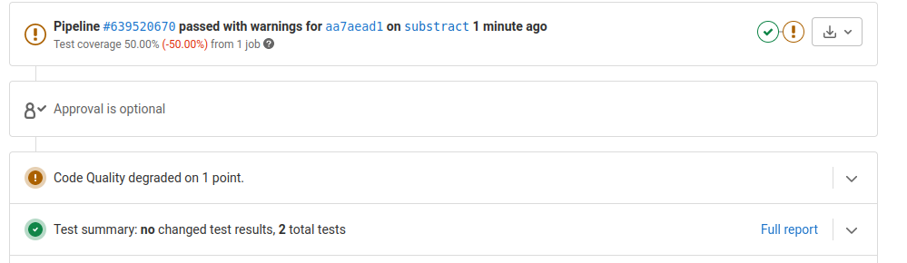
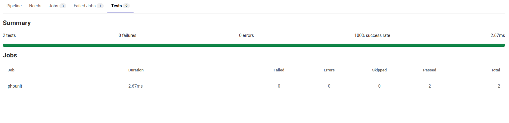
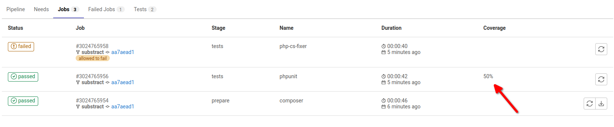
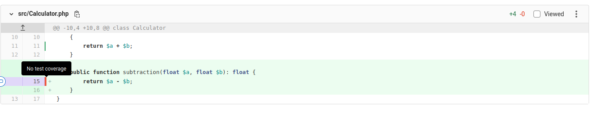
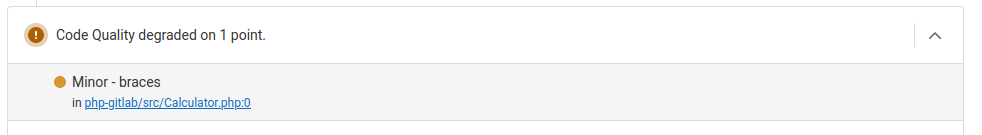
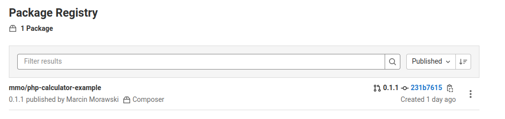

# README

This is simple PHP project to show possible integration between PHP quality assurance tools and GitLab.
Inspired by articles [Revisiting GitLab as a PHP Developer](https://dev.to/realflowcontrol/revisiting-gitlab-as-a-php-developer-5h9l)
and [Private Composer Repositories with GitLab](https://php.watch/articles/composer-gitlab-repositories).

Sample MR which show all features here - [https://gitlab.com/gitlab-integration-mmo/php-gitlab/-/merge_requests/1](https://gitlab.com/gitlab-integration-mmo/php-gitlab/-/merge_requests/1)

GitLab composer repository - [https://gitlab.com/gitlab-integration-mmo/php-gitlab/-/packages](https://gitlab.com/gitlab-integration-mmo/php-gitlab/-/packages)

## Unit test reports

To enable this feature check commit - [1ce6a6](https://github.com/morawskim/gitlab-php-integration/commit/1ce6a60cfaf91b58838202eb2e81a003375d77ab).

The results will be displayed in details of pipeline execution (tab Tests) and also in details of Merge Request.

[Unit test reports](https://docs.gitlab.com/ee/ci/testing/unit_test_reports.html)

## Test code coverage

To enable this feature check commit - [e20149](https://github.com/morawskim/gitlab-php-integration/commit/e20149558f88b6f0436abb2b06c7177da7b7041b).

[Add test coverage results using coverage keyword](https://docs.gitlab.com/ee/ci/pipelines/settings.html#add-test-coverage-results-using-coverage-keyword)

The result will be displayed in details of pipeline execution (tab Jobs) and also in details of Merge Request.

## Test code coverage visualization

To enable this feature check commit - [ab1c0a](https://github.com/morawskim/gitlab-php-integration/commit/ab1c0a5a35d84169fda7776945729528e0100686).

[Test coverage visualization](https://docs.gitlab.com/ee/ci/testing/test_coverage_visualization.html)

The result will be displayed in details of Merge Request (tab Changes).

## Code style violations

To enable this feature check commit - [d5fa1b](https://github.com/morawskim/gitlab-php-integration/commit/d5fa1b2bf8bbed8d5423dd0fe1951cee2d0890fd).

The result will be displayed in details of Merge Request

## Composer Repositories

To enable this feature check commit - [641511](https://github.com/morawskim/gitlab-php-integration/commit/641511014a2e4437fd9cd3cc118e9fd60d36fc6b).

This feature works only when your project is inside group.
So create project under your username will not work.

You must enable Package Registry (default is enabled). 
In project, from hover on "Settings", then click "General".
Scroll to section "Visibility, project features, permissions" and expand this section.
Ensure that "Packages" feature is enabled.

